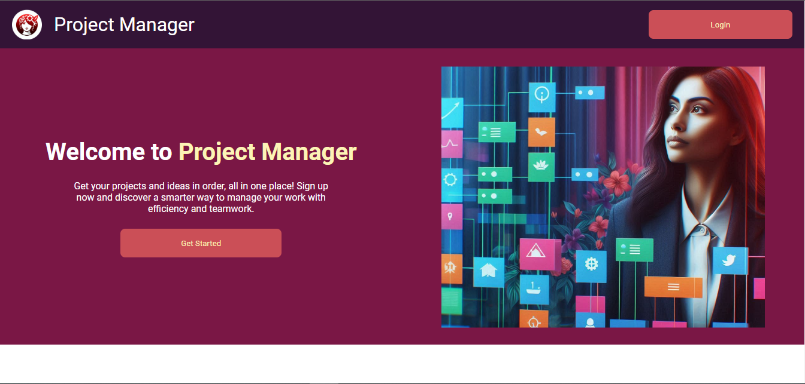
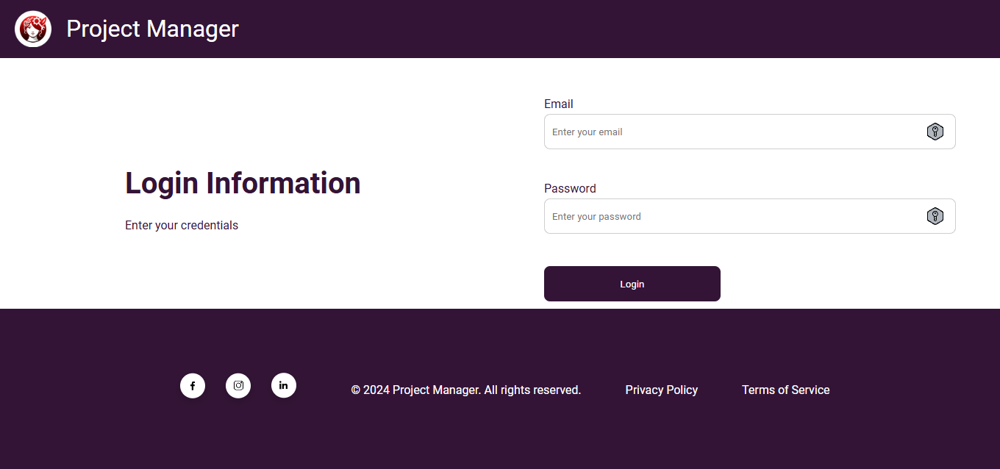
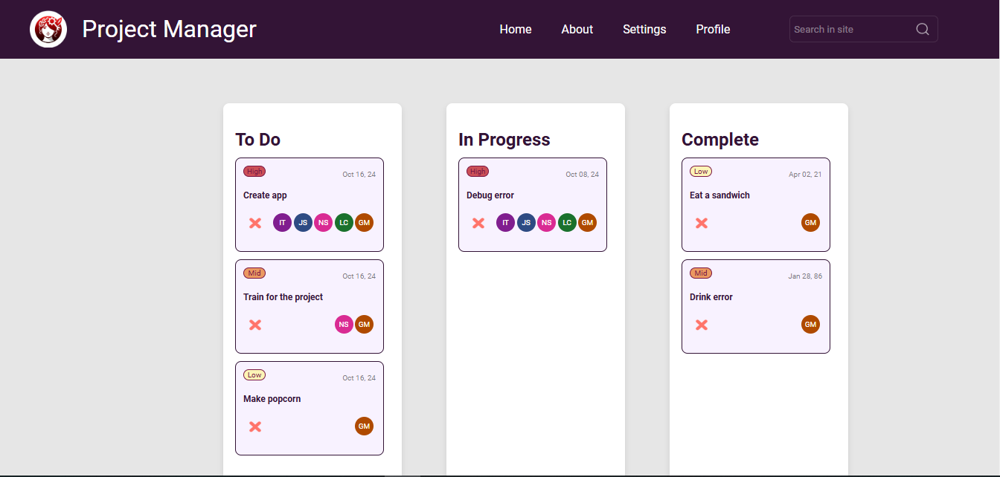
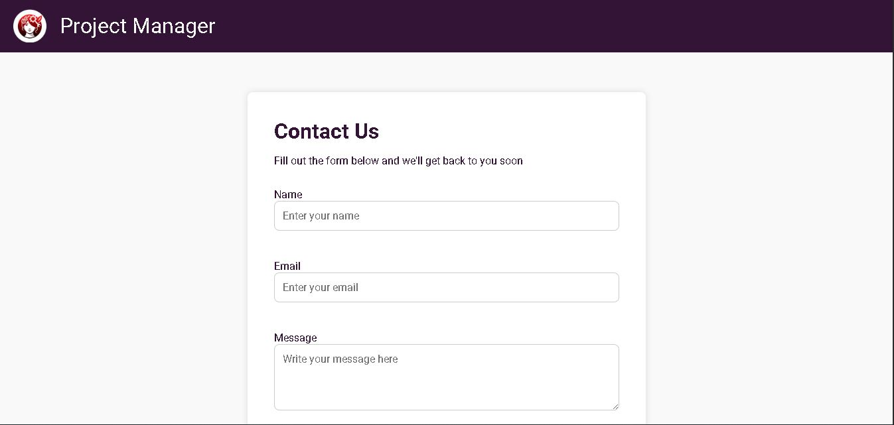

# Desafio_1_Semana_4_TI_Rex

## 📌 Sobre

Este repositório contém a solução completa da atividade MAPA da disciplina Programação Frontend do curso de Engenharia de Software. O objetivo da atividade é desenvolver um website completo e responsivo de tema livre, utilizando HTML5, CSS e Javascript. O projeto implementa todas as funcionalidades obrigatórias como:

✅ Layout responsivo que se adapte a diferentes tamanhos de tela

✅ Menu de navegação funcional

✅ Formulário de contato com validação via JavaScript

✅ Uso de pelo menos dois efeitos interativos com JavaScript/jQuery

✅ Aplicação de conceitos de SEO básico no código

## 🚀 Tecnologias utilizadas


## Páginas Implementadas

### 1. Home



✅ **Validação de Formulário:** Os campos "Nome" e "E-mail" são validados ao perderem o foco e também ao clicar no botão "Subscribe".

✅ **Armazenamento Local:** Dados do formulário (nome e e-mail) são salvos no LocalStorage quando preenchidos corretamente.

✅ **Modal de Confirmação:** Exibe uma mensagem de sucesso ao completar o subscribe.

✅ **Responsividade:** Design responsivo para telas até 300px.

### 2. Login



✅ **Validação de Formulário:** Os campos "E-mail" e "Senha" são validados ao perderem o foco e também ao clicar no botão "Login".

✅ **Redirecionamento:** Usuário é redirecionado à página do Kanban após um login bem-sucedido.

✅ **Estática Fixa:** A página não possui scroll.

### 3. Kanban



✅ **Colunas:** "To Do", "In Progress" e "Complete".

✅ **Arrastar e Soltar:** Implementado com JavaScript puro, permitindo que os cards sejam movidos entre as colunas.

✅ **Design Responsivo:** Página ajustada para telas pequenas (até 300px).

### 4. Contact



✅ Formulário de Contato: Os campos "Name", "Email" e "Message" são obrigatórios e validados antes do envio.

✅ Validação em Tempo Real: Feedback de erro exibido dinamicamente ao digitar informações inválidas ou incompletas.

✅ Notificação Animada: Uma toast message animada aparece no canto inferior direito após o envio bem-sucedido do formulário, desaparecendo automaticamente após 3 segundos.

✅ Efeito Visual Interativo: Ao focar nos campos do formulário, bordas e sombras são animadas com JavaScript/CSS para melhorar a experiência do usuário.

✅ Design Responsivo: A página de contato foi ajustada para diferentes tamanhos de tela, garantindo boa usabilidade em dispositivos móveis.

✅ Acessibilidade: Uso de label associado corretamente aos campos para facilitar a navegação por leitores de tela e melhorar a experiência de acessibilidade.

## Funcionalidades Adicionais

✅ **Validação de Inputs:** Campos dos formulários são validados já ao perderem o foco, melhorando a experiência do usuário.

✅ **Responsividade Completa:** Todas as páginas foram ajustadas para dispositivos com largura mínima de 300px.

✅ **Efeitos de Hover:** Implementados em botões e links.

✅ **Mensagem de Confirmação:** Alert exibido ao realizar o subscribe com sucesso.

## Estrutura do Repositório

```
/
|-- index.html         # Página inicial (Home)
|-- login.html         # Página de Login
|-- kanban.html        # Página do Kanban
|-- contact.html       # Página de Contato
|
|
|-- assets/
|   | -- images         # Imagens utilizadas no website
|   | -- project_images # Screenshot do projeto
|   | -- svg            # Ícones utilizados no website
|
|
|-- css/               # Estilos CSS
|   |-- index.css      # Estilo da página inicial
|   |-- login.css      # Estilo da página de login
|   |-- footer.css     # Estilo do rodapé
|   |-- contact.css    # Estilo da página de contato
|   |-- header.css     # Estilo do cabeçalho
|   |-- global/        # Estilos globais
|       |-- variables.css  # Variáveis globais de CSS
|       |-- reset.css      # Reset de estilos padrão
|
|-- scripts/           # Scripts JavaScript
|   |-- index.js       # Scripts da página inicial
|   |-- login.js       # Scripts da página de login
|   |-- kanban.js      # Scripts da página Kanban
|   |-- contact.js     # Scripts da página Contato
|
|-- README.md         # Documentação do projeto
```

## 🛠️ Como executar o projeto

Clone o repositório:

- Clone este repositório em sua máquina local usando o comando `git clone`.

  -git clone [Repo](https://github.com/EmersonPenelli/ProjectManager)

## 🙋🏻‍♂️ Autor

| [<br><sub>Emerson Penelli</sub>](https://github.com/EmersonPenelli) |
| :--------------------------------------------------------------------------------------------------------------------------------------------: |
